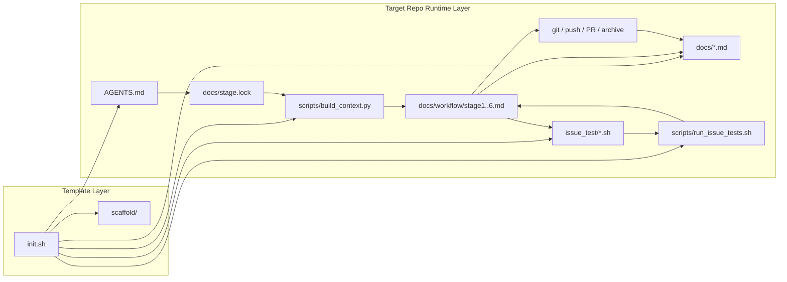
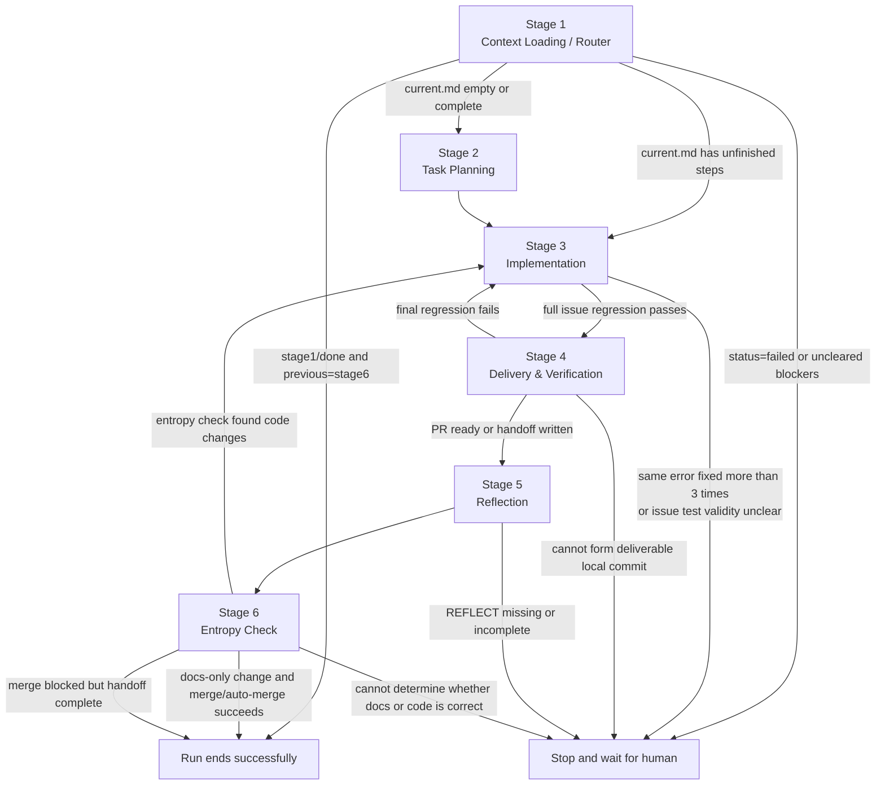

# Agent Workflow Template

🌐 [中文版](README.zh.md)

A template repository that breaks down AI agent development workflows into an "initialization scaffold + document state machine + issue-level cumulative regression" system.

This solves not "how to write prompts" but "how to turn an agent's workflow into an engineering system that is repeatable, verifiable, and recoverable after interruption".

## Production Verification

This workflow has been fully validated in a real GitHub repository — not just internal template self-testing.

- Verification date: 2026-03-29
- Target repository: [cf3i/MiniAVLtree](https://github.com/cf3i/MiniAVLtree)
- Task: Add "HTML visualization page for AVL tree" to `docs/plan/backlog.md`
- Stage 2: Created independent branch `codex/2-html-avl-visualizer` per the rules
- Stage 4: Created PR [#2](https://github.com/cf3i/MiniAVLtree/pull/2) via `bash scripts/deliver_pr.sh ensure --base main`
- Stage 6: Completed final merge via `bash scripts/deliver_pr.sh merge --merge-method squash`
- Final state: Target repository returned to `stage1 / done / previous=stage6`

This production regression also caught a real bug: the `--jq` flag quoting in `deliver_pr.sh` when outputting `MERGE_COMMIT_SHA` was incorrect. The bug was fixed and written back to the template.

## How to Use This Project

### 1. Initialize Your Target Repository with `init.sh`

Prerequisites:

- The target directory must already be a Git repository.
- The target directory must not be this template repository itself.
- `python3` and `PyYAML` must be available locally, since `scripts/build_context.py` depends on them.
- If you want documents automatically filled, you need an available AI CLI such as `codex` or `claude`.

Typical usage:

```bash
# Run in your target project, not in this template repository
cd /path/to/your-repo

# Interactive initialization
bash /path/to/Agent-Workflow-Template/init.sh

# Non-interactive adopt mode
bash /path/to/Agent-Workflow-Template/init.sh \
  --adopt \
  --cli codex \
  --ultra \
  --non-interactive

# Copy skeleton only, skip AI document filling
bash /path/to/Agent-Workflow-Template/init.sh \
  --skip-fill \
  --non-interactive
```

Core parameters supported by `init.sh`:

| Parameter | Effect |
| --- | --- |
| `--adopt` | Onboard an existing repository; documentation prioritizes describing "current facts" |
| `--greenfield` | Initialize for a brand-new project |
| `--skip-fill` | Copy skeleton only; do not call AI to fill documents |
| `--cli <claude\|codex>` | Specify the CLI to use during initialization |
| `--model <name>` | Specify model for `codex` |
| `--reasoning-effort <level>` | Specify reasoning effort for `codex` |
| `--single-call` | Fill all documents with a single AI call |
| `--ultra` | Fill documents per-file using multiple AI calls |
| `--lang <zh\|en>` | Choose document language (default: zh) |
| `--docs-review` / `--no-docs-review` | Whether to perform an additional read-only documentation review |
| `--non-interactive` | Disable the interactive wizard |

Additional notes:

- The script's built-in defaults are `claude + gpt-5.4 + xhigh`.
- If you use `codex` without explicitly specifying an execution mode, the script defaults to `--ultra` and skips the independent docs review by default.
- `init.sh` will refuse to run in a non-Git repository because this workflow depends on `stage.lock` commits, branches, and PR delivery.

### 2. How to Start After Initialization

After successful initialization, your target repository will contain:

- `AGENTS.md`: Agent startup protocol and hard rules
- `docs/`: State machine, project context, plans, blockers, decisions
- `issue_test/`: Independent regression script for each issue
- `scripts/`: Context loader and issue test runner

Daily operation:

```bash
# Agent startup entry point
codex "Read AGENTS.md, then start working."

# Manually inspect which context a Stage will load
python3 scripts/build_context.py --stage stage3

# Run cumulative regression for all historical + current issues
bash scripts/run_issue_tests.sh

# Run historical regression, excluding the current issue's script
bash scripts/run_issue_tests.sh --exclude issue_test/<issue_id>.sh
```

### 2.5 Write to `backlog.md` Before Starting a New Task

In this template, the formal entry point for "what to develop" is not changing code directly or writing `current.md` first — it is adding the task to `docs/plan/backlog.md`.

Recommended order:

1. Add a `- [ ]` entry in `docs/plan/backlog.md`
2. Start the agent
3. Stage 2 selects an entry from the backlog
4. Stage 2 generates the `issue_id`
5. Stage 2 creates `issue_test/<issue_id>.sh`
6. Stage 2 writes the implementation steps to `docs/plan/current.md`
7. Stage 3 begins implementation; Stage 4 marks the backlog entry as `- [x]` after delivery

The role of each:

- `docs/plan/backlog.md`: defines "what comes next"
- `docs/plan/current.md`: defines "how to execute the current issue step by step"
- `issue_test/<issue_id>.sh`: defines "how to verify acceptance when this issue is complete"

In short: `backlog.md` is the development entry point, `current.md` is the in-progress plan, and `issue_test` is the acceptance script.

### 3. What Does `init.sh` Actually Do?

`init.sh` does more than copy files. It divides template initialization into four types of actions:

| Category | How it's handled | Files |
| --- | --- | --- |
| Fixed skeleton | Copied directly from `scaffold/<lang>/` | `docs/stage.lock`, `docs/workflow/stage*.md`, `docs/wisdom.md`, `docs/antipatterns.md`, `docs/blockers.md`, `docs/plan/current.md`, `docs/plan/archive/README.md`, `issue_test/README.md`, `scripts/build_context.py`, `scripts/run_issue_tests.sh`, `scripts/deliver_pr.sh` |
| AI-filled | Template copied first, then AI fills it based on target repo facts | `docs/overview.md`, `docs/architecture.md`, `docs/conventions.md`, `docs/quality.md`, `docs/security.md`, `docs/progress.md`, `docs/plan/backlog.md` |
| Script-written | Copied, then placeholders replaced by the script | `docs/decisions.md` — D-001 date and initialization background inserted by `sed` |
| Deferred copy | Copied after AI filling completes to avoid affecting the initialization prompt | `AGENTS.md` |

During initialization, the script also generates artifacts in `.git/.agent-workflow-init/` in the target repository:

- `logs/*.log`: AI call logs for each step
- `final-review.md`: Human supplementation checklist generated by local rules
- `docs-review.md`: Optional read-only documentation review report

## Project Architecture

This repository consists essentially of two layers:

1. Template layer: `init.sh + scaffold/`
2. Runtime layer: `AGENTS.md + docs/ + issue_test/ + scripts/` initialized into the target repository

The template layer is responsible for "generating the runtime system"; the runtime layer is responsible for "driving agent work".

### Top-Level Structure

```text
Agent-Workflow-Template/
├── init.sh
├── scaffold/
│   ├── zh/          ← Chinese scaffold files
│   │   ├── AGENTS.md
│   │   ├── docs/
│   │   ├── issue_test/
│   │   └── scripts/
│   └── en/          ← English scaffold files
│       ├── AGENTS.md
│       ├── docs/
│       ├── issue_test/
│       └── scripts/
├── docs/
├── issue_test/
└── scripts/
```

Two points to note:

- `scaffold/` is the template source files, used for copying to other repositories.
- The `docs/`, `issue_test/`, and `scripts/` at the repository root are this template repository's own working copy, used to maintain and validate the template itself.

### Runtime Layers

| Layer | Components | Responsibility |
| --- | --- | --- |
| Bootstrap | `init.sh`, `scaffold/` | Initialize the target repository, copy the skeleton, fill initial documents |
| Control | `AGENTS.md`, `docs/stage.lock`, `docs/workflow/stage*.md` | Define agent startup protocol, current state, and Stage transition rules |
| Context | `docs/overview.md`, `architecture.md`, `conventions.md`, `quality.md`, `security.md`, `progress.md`, `decisions.md`, `blockers.md`, `wisdom.md`, `antipatterns.md`, `docs/plan/*` | Provide project facts, rules, plans, history, and blocker information |
| Harness | `scripts/build_context.py`, `issue_test/*.sh`, `scripts/run_issue_tests.sh` | Mechanically load context, mechanically run cumulative regression |
| Delivery | `git commit`, `git push`, `scripts/deliver_pr.sh`, `docs/plan/archive/*` | Convert changes into deliverable results and archive them |

### Architecture Diagram



## What is `scaffold/`?

`scaffold/` is not sample code — it is the "file master template" used during initialization.

When initializing a target repository, `init.sh` does not read from the currently running `docs/` in the root directory. It reads strictly from `scaffold/<lang>/`.

The contents of `scaffold/<lang>/` fall into three categories:

| Category | Typical files | Purpose |
| --- | --- | --- |
| State machine skeleton | `AGENTS.md`, `docs/stage.lock`, `docs/workflow/stage*.md` | Defines the agent's fixed operating protocol |
| Project fact templates | `docs/overview.md`, `docs/architecture.md`, `docs/conventions.md`, `docs/quality.md`, `docs/security.md`, `docs/progress.md`, `docs/plan/backlog.md` | Filled by AI based on target repository content during initialization |
| Harness scripts | `scripts/build_context.py`, `scripts/run_issue_tests.sh`, `issue_test/README.md` | Turn "what to read" and "how to verify" into fixed scripts |

In short:

- `scaffold/` determines "what a new repository will look like after initialization"
- `docs/` determines "what this repository looks like right now"

## Run Model

A single agent run may complete only one issue loop.

The standard cycle is:

1. Read `AGENTS.md`
2. Read `docs/stage.lock`
3. Execute `python3 scripts/build_context.py --stage <current>`
4. Read all context files from the output
5. Execute `docs/workflow/<current>.md`
6. Update `docs/stage.lock`
7. If returning to `current: stage1` with `status: done` and `previous: stage6`, this run ends

This means:

- Picking multiple backlog issues in the same run is not allowed.
- Any Stage failure requires writing `docs/blockers.md` and stopping.
- Every `stage.lock` update requires a separate git commit.
- New tasks must enter `docs/plan/backlog.md` first, then Stage 2 converts them to `current.md` and `issue_test/<issue_id>.sh`.

## Stage Input Model

`scripts/build_context.py` first injects global context, then injects incremental context per Stage.

All Stages load:

- `docs/overview.md`
- `docs/architecture.md`
- `docs/conventions.md`
- `issue_test/README.md`
- `docs/wisdom.md`, `docs/antipatterns.md` (if they exist)

Incremental inputs per Stage:

| Stage | Additional inputs |
| --- | --- |
| Stage 1 | `docs/stage.lock`, `docs/progress.md`, `docs/blockers.md`, `docs/plan/current.md`, `docs/workflow/stage1.md` |
| Stage 2 | `docs/plan/backlog.md`, `docs/decisions.md`, `docs/workflow/stage2.md` |
| Stage 3 | `docs/plan/current.md`, `docs/security.md`, `issue_test/<issue_id>.sh`, `docs/workflow/stage3.md` |
| Stage 4 | `docs/plan/current.md`, `docs/quality.md`, `issue_test/<issue_id>.sh`, `docs/workflow/stage4.md` |
| Stage 5 | `docs/decisions.md`, `docs/plan/archive/<issue_id>.md`, `docs/workflow/stage5.md` |
| Stage 6 | `docs/progress.md`, `docs/decisions.md`, `docs/plan/archive/<issue_id>.md`, `docs/workflow/stage6.md` |

The key design: each Stage reads only the files it actually needs, preventing the agent from wandering through irrelevant documents.

## Stage Flow Diagram



## Input, Output, and Modification Surface Per Stage

| Stage | Input | Output | What it modifies |
| --- | --- | --- | --- |
| Stage 1 | `stage.lock`, `progress.md`, `blockers.md`, `plan/current.md` | Routing result: end current run, or proceed to Stage 2 / Stage 3 | `docs/stage.lock` |
| Stage 2 | `plan/backlog.md`, `decisions.md`, `overview.md`, `antipatterns.md` | Determined `issue_id`, switched to the issue's branch, created issue test, written `current.md`, state advanced to Stage 3 | Current git branch, `issue_test/<issue_id>.sh`, `docs/plan/current.md`, `docs/stage.lock`, optionally `docs/overview.md` and `docs/decisions.md` |
| Stage 3 | `plan/current.md`, `security.md`, current issue test, historical issue tests, business code | Code implementation complete, full regression passes, state advanced to Stage 4 | Business code, tests, `docs/plan/current.md`, `docs/stage.lock`, optionally `docs/architecture.md` and `docs/decisions.md` |
| Stage 4 | `plan/current.md`, `quality.md`, full regression results, remote git state | Local commit, PR URL or manual handoff, progress update, plan archived, state advanced to Stage 5 | Git history, `docs/progress.md`, `docs/plan/archive/<issue_id>.md`, `docs/plan/current.md`, `docs/plan/backlog.md`, `docs/stage.lock` |
| Stage 5 | `decisions.md`, archived plan, current issue context | Reflection result, REFLECT file, reusable patterns or antipatterns, state advanced to Stage 6 | `docs/plan/archive/REFLECT-<issue_id>.md`, `docs/wisdom.md`, `docs/antipatterns.md`, `docs/stage.lock`, optionally `docs/decisions.md`, `docs/architecture.md`, `docs/conventions.md` |
| Stage 6 | All docs, `progress.md`, `decisions.md`, `plan/archive/<issue_id>.md`, code state, PR state | Docs and code aligned; if docs-only, attempt final merge/auto-merge and end run; if code changed, return to Stage 3 | `docs/*.md`, `docs/stage.lock`, optionally append to `docs/plan/archive/<issue_id>.md`, and final remote merge state |

## Core Constraints of This Template

- One issue per run.
- Every issue must be bound to an `issue_test/<issue_id>.sh`.
- Historical issue tests are retained indefinitely; hiding regressions by deleting or weakening old tests is not allowed.
- Every `docs/stage.lock` update must be a separate commit.
- Any blocker requires writing `docs/blockers.md` and stopping.
- Documentation is not a manual — it is the agent's runtime input.

If you can only remember one sentence, remember this:

> `init.sh` loads the template into the target repository. `stage.lock` drives the state machine. `build_context.py` feeds context. `issue_test/*.sh` turns each issue's acceptance criteria into executable scripts.
